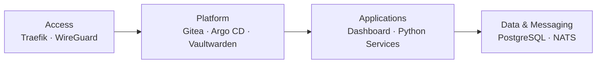

# Self-Hosted Kubernetes Infrastructure

A self-hosted Debian and k3s platform for GitOps, private networking, automation, data services and internal applications.

I actively operate and develop this environment as a practical platform for Kubernetes, Linux administration, networking, GitOps and infrastructure automation.

> This repository contains architecture documentation and sanitized examples only.  
> Production credentials, private network information and proprietary application code are intentionally excluded.

---

## Overview

The platform runs on a dedicated **Debian Linux** server with **k3s** as the Kubernetes distribution.

It hosts platform services, internal applications and automation workloads while providing practical experience with:

- Kubernetes operations
- GitOps
- Linux administration
- private networking
- ingress and service exposure
- CI/CD
- persistent data
- asynchronous messaging
- infrastructure troubleshooting

Some workloads support internal software and automated trading-related systems, while the infrastructure itself is designed as a general-purpose self-hosted platform.

---

## Platform Architecture



For the complete architecture:

**[View Platform Architecture →](diagrams/architecture.md)**

For the application delivery process:

**[View CI/CD & GitOps Deployment Flow →](diagrams/deployment-flow.md)**

---

## Technology Stack

| Area | Technologies |
|---|---|
| **Host & Orchestration** | Debian Linux, k3s, Kubernetes |
| **GitOps** | Git, Gitea, Argo CD |
| **Networking** | Traefik, WireGuard |
| **Data & Messaging** | PostgreSQL, NATS |
| **Applications** | Python services, internal dashboard |
| **Internal Services** | Vaultwarden |
| **Container Delivery** | CI pipeline, GHCR |

---

## Engineering Focus

The project is built around a few principles:

- **Git as source of truth**
- **private-by-default infrastructure**
- **minimal public exposure**
- **declarative deployments**
- **clear separation between platform and applications**
- **automation of repetitive operations**
- **simplicity over unnecessary infrastructure complexity**

The environment has also involved real troubleshooting around VPN connectivity, routing, MTU behavior, firewalling, Kubernetes networking and service reachability.

---

## Documentation

| Topic | Documentation |
|---|---|
| Platform design | [Architecture](docs/architecture.md) |
| Networking & VPN | [Networking](docs/networking.md) |
| GitOps | [GitOps](docs/gitops.md) |
| CI/CD | [CI/CD](docs/ci-cd.md) |
| Application workloads | [Applications](docs/application.md) |
| Operations & troubleshooting | [Operations](docs/operations.md) |
| Engineering takeaways | [Lessons Learned](docs/lessons-learned.md) |

---

## Examples

The [`examples/`](examples/) directory contains simplified and sanitized examples of infrastructure patterns used by the platform.

```text
examples/
├── argocd/
│   └── application-example.yaml
├── ci/
│   └── pipeline-example.yaml
├── kubernetes/
│   ├── deployment-example.yaml
│   ├── ingress-example.yaml
│   ├── namespace.yaml
│   ├── pvc-example.yaml
│   └── service-example.yaml
└── networking/
    └── network-policy-example.yaml
```

These examples demonstrate concepts without exposing production configuration.

---

## Repository Structure

```text
.
├── README.md
├── diagrams/
│   ├── README.md
│   ├── architecture.md
│   └── deployment-flow.md
├── docs/
│   ├── README.md
│   ├── architecture.md
│   ├── application.md
│   ├── ci-cd.md
│   ├── gitops.md
│   ├── lessons-learned.md
│   ├── networking.md
│   └── operations.md
└── examples/
    ├── argocd/
    ├── ci/
    ├── kubernetes/
    └── networking/
```

---

## Security

This repository intentionally does not contain:

- credentials or API tokens
- SSH or VPN keys
- private IP addresses
- internal DNS information
- production secrets
- security-sensitive firewall configuration
- broker or trading account credentials
- proprietary trading algorithms
- complete production manifests

Published examples are sanitized or recreated specifically for documentation purposes.

---

## Status

**Active / continuously evolving**

The platform is actively used and extended as I continue working with Kubernetes, Linux, networking, automation and platform engineering.
