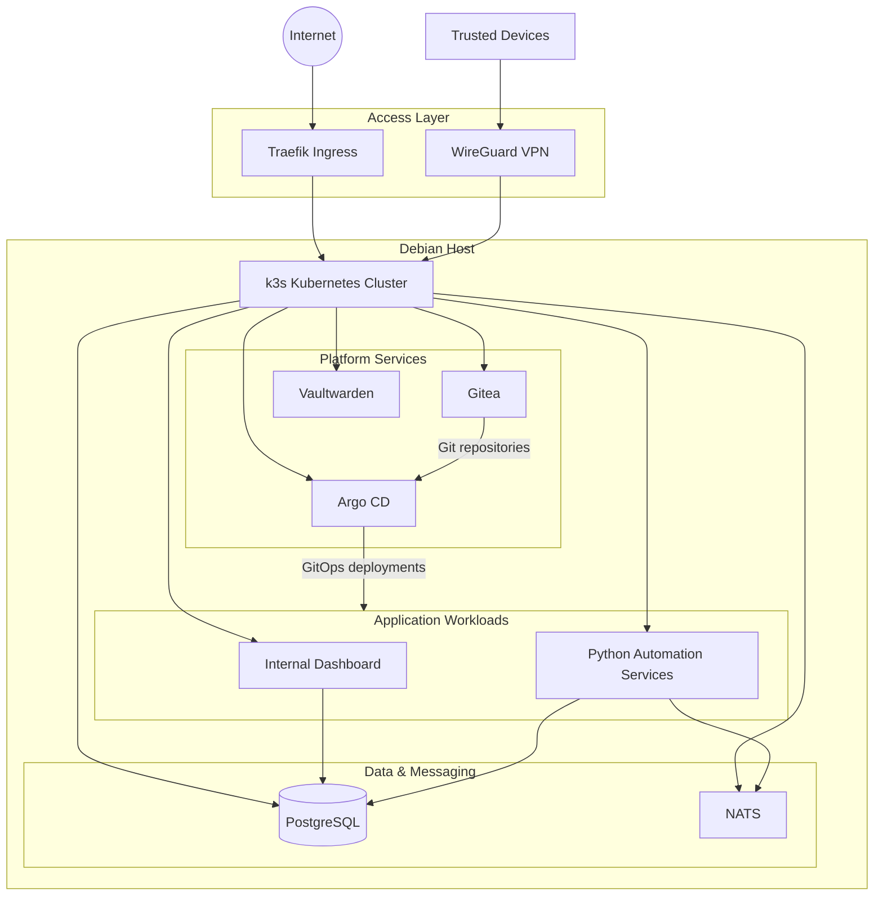

# Self-Hosted Kubernetes Infrastructure

A self-hosted Debian and k3s platform for GitOps, private networking, automation, data services and internal applications.

The environment is continuously developed and operated as both a practical infrastructure platform and a technical environment for internal software and automation workloads.

> This repository documents the architecture, engineering decisions and selected sanitized examples of the platform.  
> Production credentials, secrets, private network information and proprietary application code are intentionally not published.

---

## Overview

The platform runs on a dedicated Debian server and uses **k3s** as its Kubernetes distribution.

It hosts several internal services and applications while providing a practical environment for working with:

- Kubernetes operations
- GitOps
- Linux administration
- networking
- ingress and service exposure
- persistent data
- service-to-service messaging
- infrastructure automation
- private remote access
- troubleshooting and reliability

Some workloads support personal software and automated trading-related applications, while the infrastructure itself is designed as a general-purpose self-hosted platform.

---

## Architecture



The diagram is intentionally simplified and does not represent sensitive production networking details.

---

## Technology Stack

### Infrastructure

| Technology | Purpose |
|---|---|
| **Debian Linux** | Base operating system |
| **k3s** | Lightweight Kubernetes distribution |
| **Traefik** | Ingress and HTTP routing |
| **WireGuard** | Secure private access to internal services |

### GitOps & Development

| Technology | Purpose |
|---|---|
| **Argo CD** | Declarative GitOps deployments |
| **Gitea** | Self-hosted Git repositories |
| **Git** | Version control and infrastructure configuration |

### Data & Messaging

| Technology | Purpose |
|---|---|
| **PostgreSQL** | Persistent application and operational data |
| **NATS** | Lightweight asynchronous messaging between services |

### Applications & Internal Services

| Technology | Purpose |
|---|---|
| **Vaultwarden** | Self-hosted password management |
| **Python services** | Automation and internal application workloads |
| **Custom dashboard** | Visualization and management of internal data and services |

---

## GitOps & Deployment Workflow

Deployments are designed around a Git-based workflow rather than manual changes inside the cluster.


A typical deployment follows this process:

1. Application or infrastructure configuration is changed in Git.
2. The desired state is stored in the repository.
3. Argo CD detects the change.
4. Argo CD synchronizes the configuration with the Kubernetes cluster.
5. The resulting state can be inspected and corrected declaratively.

The goal is to minimize manual cluster changes and make deployments reproducible.

---

## Networking & Security

The platform separates public access from private administrative access.

### Public access

Selected services can be exposed through **Traefik**, which acts as the Kubernetes ingress layer.

### Private access

Administrative and private services are accessed through **WireGuard** instead of exposing them directly to the public internet.

This allows internal services to remain reachable from trusted devices without making every application publicly accessible.

### Security principles

The environment is designed around several basic principles:

- expose only services that require external access
- keep administrative services private
- avoid storing secrets in public Git repositories
- separate configuration from credentials
- prefer declarative configuration over manual changes
- minimize unnecessary network exposure

---

## Data & Messaging

### PostgreSQL

PostgreSQL is used as the primary persistent data store for internal applications and automation services.

Typical use cases include:

- application state
- collected operational data
- internal dashboard data
- data generated by automation services

### NATS

NATS provides lightweight asynchronous messaging between services.

It allows individual components to communicate without requiring every service to be directly coupled to every other service.

This is particularly useful for event-driven automation and data-processing workloads.

---

## Engineering Decisions

One of the main goals of this project is not simply to deploy software, but to evaluate technologies and understand their operational trade-offs.

### NetBird vs. WireGuard

I initially evaluated **NetBird** as a mesh VPN solution for secure connectivity between my devices and the server.

The setup worked correctly, but I observed latency and responsiveness issues on my iPhone and iPad clients.

For my specific environment, I therefore migrated to a more direct **WireGuard-based setup**, which provided more predictable behavior and lower complexity.

This was not a general limitation of NetBird, but an engineering decision based on the behavior observed in my environment.

### GitOps with Argo CD

I chose Argo CD to move deployments toward a declarative GitOps workflow.

Instead of manually applying configuration changes to Kubernetes, the intended state is stored in Git and synchronized with the cluster.

This provides several advantages:

- reproducible deployments
- clearer configuration history
- easier rollback and comparison
- reduced configuration drift
- fewer manual deployment steps

### k3s

For a single-server self-hosted environment, I chose **k3s** instead of a heavier Kubernetes distribution.

It provides the Kubernetes APIs and operational model I wanted to work with while keeping the resource footprint appropriate for the environment.

### NATS

NATS was selected as a lightweight messaging layer for services that benefit from asynchronous communication.

This allows producers and consumers to evolve more independently than with tightly coupled direct communication.

### PostgreSQL

PostgreSQL serves as the main relational persistence layer because it provides a mature and flexible foundation for application and operational data.

---

## Operational Experience

Operating the environment has required troubleshooting beyond simply deploying containers.

Areas I have worked with include:

- Kubernetes service and deployment troubleshooting
- Linux networking
- VPN configuration
- ingress routing
- persistent storage
- DNS and service connectivity
- firewall behavior
- MTU-related networking issues
- routing problems
- application deployment failures
- service communication
- configuration changes and migrations

The environment is intentionally used as an evolving platform rather than a static installation.

---

## Lessons Learned

### Infrastructure is more than deployment

Running an application successfully once is different from operating it reliably over time.

Networking, storage, upgrades, service dependencies and failure recovery become increasingly important as more services are added.

### GitOps reduces operational ambiguity

Keeping desired configuration in Git makes it substantially easier to understand how the environment is supposed to look and how it changed over time.

### Networking problems are often layered

Issues involving VPNs, routing, MTU, Kubernetes networking and host firewalls can interact in ways that are not immediately obvious.

Troubleshooting these problems has been one of the most valuable parts of operating the environment.

### Simpler solutions can be better

The NetBird-to-WireGuard migration reinforced that additional abstraction is not always beneficial.

The best solution depends on the actual constraints and behavior of the environment.

### Documentation matters

Infrastructure becomes significantly easier to maintain when architecture and engineering decisions are documented alongside the configuration itself.

---

## Future Development

The platform is actively maintained and will continue to evolve.

Planned areas of experimentation and improvement include:

- observability and monitoring
- automated backups
- improved disaster-recovery procedures
- infrastructure-as-code
- secret management
- improved CI/CD integration
- automated health checks
- security hardening
- additional GitOps automation

---

## Repository Structure

The public repository is intended to contain documentation and sanitized examples rather than the complete production configuration.

```text
.
├── README.md
├── docs/
│   ├── architecture.md
│   ├── networking.md
│   ├── gitops.md
│   └── lessons-learned.md
├── diagrams/
│   └── architecture.png
└── examples/
    ├── argocd/
    ├── kubernetes/
    └── networking/
```

---

## Security & Disclosure

This repository intentionally does **not** contain:

- credentials
- passwords
- API tokens
- SSH keys
- VPN keys
- production secrets
- private IP addresses
- sensitive firewall configuration
- broker or account credentials
- proprietary trading algorithms
- complete production manifests

Examples published here are sanitized or recreated specifically for documentation purposes.

---

## Status

**Active / continuously evolving**

This infrastructure is actively used and extended as I continue working with Kubernetes, Linux, networking, automation and platform engineering.
