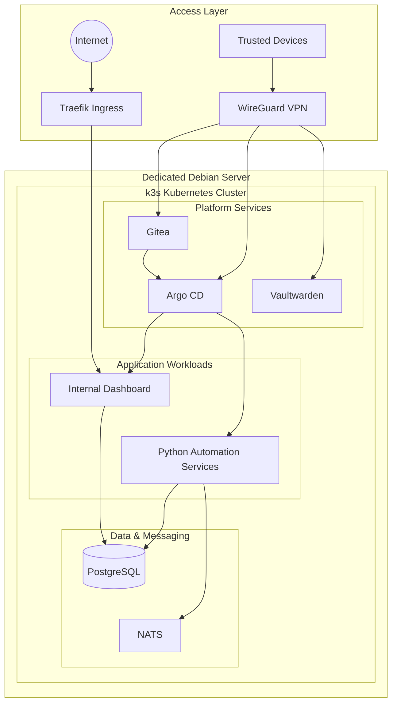

# Platform Architecture

This document describes the high-level architecture of my self-hosted Kubernetes platform.

The platform runs on a dedicated Debian server and uses k3s as the orchestration layer for platform services, internal applications and supporting data services.

The diagram is intentionally simplified. Sensitive production details such as private addresses, credentials, firewall rules and proprietary application logic are excluded.

---

## High-Level Architecture

---

## Architecture Overview

The platform is divided into four logical layers:

| Layer | Components | Responsibility |
|---|---|---|
| **Access** | Traefik, WireGuard | Public ingress and secure private access |
| **Platform** | Gitea, Argo CD, Vaultwarden | Source control, GitOps and internal platform services |
| **Applications** | Internal Dashboard, Python Services | Application and automation workloads |
| **Data & Messaging** | PostgreSQL, NATS | Persistent storage and asynchronous communication |

---

## 1. Access Layer

The access layer separates externally reachable workloads from private administrative services.

### Traefik

**Traefik** acts as the Kubernetes ingress layer.

It routes incoming HTTP/HTTPS traffic to selected workloads running inside the k3s cluster.

Only applications that require external access are intended to be exposed through this path.

### WireGuard

**WireGuard** provides private network access for trusted devices.

Administrative services such as Gitea and Argo CD can therefore remain private instead of being directly exposed to the public internet.

This follows a simple principle:

> Public where necessary, private by default.

---

## 2. Kubernetes Platform

The infrastructure runs on a dedicated **Debian Linux** server.

On top of Debian, **k3s** provides the Kubernetes orchestration layer.

k3s was selected because it provides the Kubernetes operational model while maintaining a relatively small resource footprint suitable for a self-hosted single-server environment.

The cluster is responsible for running and managing:

- platform services
- application workloads
- persistent services
- internal automation
- service networking
- application lifecycle

---

## 3. Platform Services

### Gitea

**Gitea** provides self-hosted Git repositories for application and infrastructure configuration.

Git serves as the source of truth for selected deployment configuration.

### Argo CD

**Argo CD** provides GitOps-based deployment and synchronization.

Instead of relying on repeated manual changes inside the cluster, the desired application state is stored in Git and synchronized into Kubernetes.

The detailed deployment workflow is documented separately in:

[CI/CD & GitOps Deployment Flow](deployment-flow.md)

### Vaultwarden

**Vaultwarden** provides self-hosted password management.

It is treated as an internal infrastructure service and is separated from proprietary application workloads.

---

## 4. Application Workloads

### Internal Dashboard

The platform hosts a custom internal dashboard used for visualizing and managing selected operational and application data.

### Python Automation Services

Containerized Python services perform internal automation, data collection and trading-related workloads.

The public repository documents the surrounding infrastructure only.

Proprietary business logic, execution logic and trading strategies are intentionally excluded.

---

## 5. Data & Messaging

### PostgreSQL

**PostgreSQL** provides persistent relational storage.

It is used by internal applications and automation services for data that must survive application restarts or redeployments.

### NATS

**NATS** provides lightweight asynchronous messaging between services.

This allows services to exchange events without requiring every component to communicate through tightly coupled synchronous connections.

---

## Design Principles

The architecture follows several principles:

- **Git as source of truth** for deployable application state
- **Private-by-default access** for administrative services
- **Minimal public exposure**
- **Declarative deployments** through Argo CD
- **Separation of platform and application workloads**
- **Persistent data separated from application containers**
- **Asynchronous communication where appropriate**
- **Automation of repetitive operational tasks**
- **Prefer simple solutions unless additional complexity provides a clear benefit**
