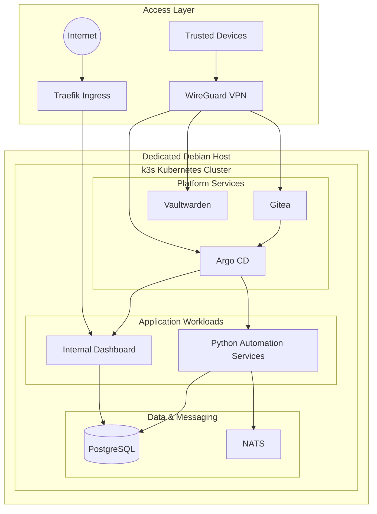

# Architecture

This document describes the high-level architecture of my self-hosted Kubernetes platform.

The diagram intentionally focuses on the major infrastructure layers and omits sensitive production details such as private addresses, credentials, firewall rules and proprietary application logic.

## High-Level Architecture

---

## Architecture Layers

| Layer | Components | Responsibility |
|---|---|---|
| **Access** | Traefik, WireGuard | Public ingress and secure private access |
| **Platform** | Gitea, Argo CD, Vaultwarden | Source control, GitOps and internal platform services |
| **Applications** | Dashboard, Python services | Internal applications and automation workloads |
| **Data & Messaging** | PostgreSQL, NATS | Persistent storage and asynchronous communication |

---

## Access Layer

### Traefik

Traefik provides ingress and routing for selected externally reachable applications.

Only services that require public access are exposed through the ingress layer.

### WireGuard

WireGuard provides secure private connectivity for trusted devices.

Administrative services such as Gitea and Argo CD remain accessible through the private network instead of being unnecessarily exposed to the public internet.

---

## Platform Services

### Gitea

Gitea provides self-hosted Git repositories for application and infrastructure configuration.

### Argo CD

Argo CD implements the GitOps deployment model.

Git contains the desired application state, while Argo CD synchronizes that state with the k3s cluster.

### Vaultwarden

Vaultwarden provides self-hosted password management and is treated as an internal service.

---

## Application Workloads

### Internal Dashboard

The dashboard provides visualization and management of internal application and operational data.

### Python Automation Services

Containerized Python services handle internal automation, data collection and trading-related workloads.

The proprietary business logic of these applications is intentionally excluded from this repository.

---

## Data & Messaging

### PostgreSQL

PostgreSQL provides persistent relational storage for internal applications and automation services.

### NATS

NATS provides lightweight asynchronous messaging for event-driven communication between services.

---

## Design Principles

The platform follows several basic principles:

- **Git as source of truth** for deployable application state
- **Private by default** for administrative services
- **Minimal public exposure**
- **Declarative deployments** through Argo CD
- **Separation of platform, applications and data**
- **Automation of repetitive operational tasks**
- **Simple infrastructure where additional complexity provides no clear benefit**

---

## Related Documentation

- [CI/CD & Deployment Flow](deployment-flow.md)
- [Networking & Security](../docs/networking.md)
- [GitOps](../docs/gitops.md)
- [Operations & Troubleshooting](../docs/operations.md)
