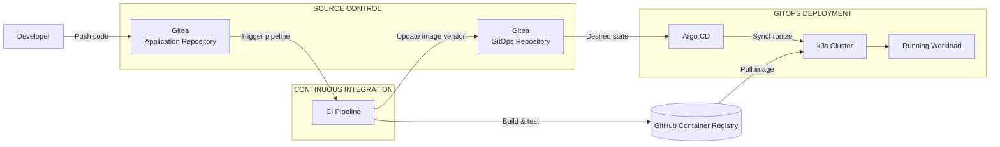

# CI/CD & GitOps Deployment Flow

This document describes how an application change moves from source control to a running workload inside the self-hosted k3s cluster.

The deployment process separates **Continuous Integration** from **GitOps-based deployment**:

- CI validates, builds and publishes the application.
- Git stores the desired deployment state.
- Argo CD synchronizes that state with Kubernetes.

## Deployment Flow



## Component Responsibilities

| Component | Responsibility |
|---|---|
| **Gitea Application Repository** | Stores application source code |
| **CI Pipeline** | Tests and builds the application |
| **GitHub Container Registry** | Stores versioned OCI container images |
| **Gitea GitOps Repository** | Stores the desired Kubernetes deployment state |
| **Argo CD** | Detects GitOps changes and synchronizes them |
| **k3s** | Runs and manages the deployed workload |

## Deployment Process

1. A code change is pushed to the application repository in **Gitea**.
2. The CI pipeline is triggered.
3. The application is validated, tested and built into an OCI container image.
4. The resulting image is published to **GitHub Container Registry (GHCR)**.
5. The GitOps repository is updated with the new image version.
6. **Argo CD** detects the desired-state change and synchronizes it with the k3s cluster.
7. Kubernetes pulls the required image from GHCR and starts the updated workload.

## Why Separate CI and Deployment?

The build pipeline does not deploy directly into Kubernetes.

Instead:

```text
CI
│
├── Test
├── Build
└── Publish Image
         │
         ▼
      GitOps
         │
         ▼
      Argo CD
         │
         ▼
        k3s
```

This keeps the responsibilities separated:

**CI**
→ produces a tested, versioned artifact.

**GitOps**
→ defines which version should run.

**Argo CD**
→ reconciles the desired state with the cluster.

This provides a more reproducible deployment process and reduces the need for manual cluster changes.

## Image Versioning

Container images should use immutable version identifiers where possible.

For example:

```text
ghcr.io/example/trading-service:a83c91f
```

instead of relying only on:

```text
ghcr.io/example/trading-service:latest
```

Using explicit image versions makes deployments easier to trace and roll back to previous versions if something unintentionally breaks.
